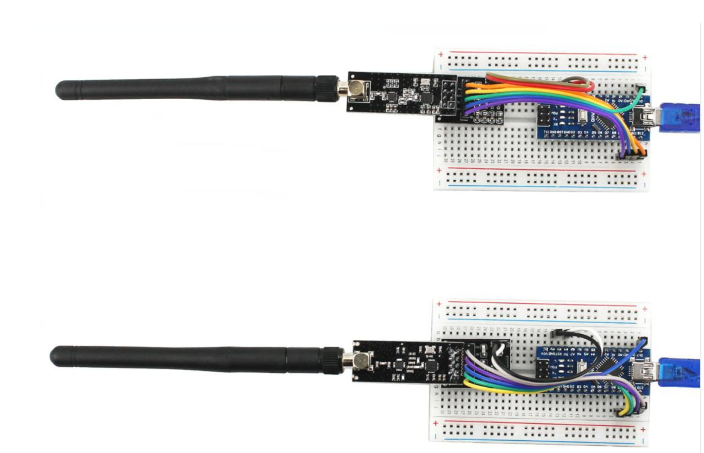

#  Howto Setup Wireless Communication   



# nrf24l01-rf-tranceiver
Experimenting with single chip 2.4 GHz transceiver

Parts Required    
2 x Arduino Nano Main Control Board   
2 x NRF24L01 Wireless Transceiver Module   
2 x Breadboard  
2 x NRF24L01 Wireless Transceiver Module Regulator N x Jumper Wires  

# PIN  Configuration  
  
| NRF24L01 Regulator | Arduino Nano |
|----------|:-------------:|
| VCC | 5V | 
| GND | GND |
| CE | D9 |
| CSN | D10 |
| MOSI | D11 |
| MISO | D12 |
| SCK | D13 |
| IRQ | is not connected |

    

# External Libraries  
```  
Sketch -> Include  Library  -> nrf24l01.zip   
```  
## Gotcha  
If used Arduino Nano, install serial port driver for mac os catalina and above    
https://github.com/adrianmihalko/ch340g-ch34g-ch34x-mac-os-x-driver/blob/master/CH34x_Install_V1.5.zip  
https://arduino.stackexchange.com/questions/804/arduino-nano-uploading-gives-error-avrdude-stk500-recv-programmer-is-not-re  
https://github.com/adrianmihalko/ch340g-ch34g-ch34x-mac-os-x-driver   


